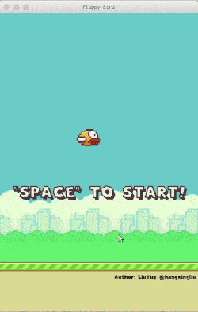

# Flappy Bird

Two simple FlappyBird demonstrations written in `C++`.
One demo use `SDL2`, and other one use `Qt`.



## flappybird-sdl

This demo is modified from my assignment of c++ lesson in my freshman year.

You can build it by scripts:

``` bash
./ci/setup-ci-env.sh # setup develop environment
mkdir flappybird-sdl/build;
cd flappybird-sdl/build;
cmake .. && make && ./flappy-bird; # make and run it
```

## flappybird-qt

This demo is based on Qt(`QOpenGLWidget`).

How to open, build and run:

1. Open `./flappybird-qt/flappybird-qt.pro` in Qt creator.
2. Build and run.

Detailed information about this Qt project: [README-QT-PROJECT.md](README-QT-PROJECT.md)

## Author

[LiuYue @hangxingliu](https://github.com/hangxingliu)

## License

[GPL-3.0](LICENSE)
